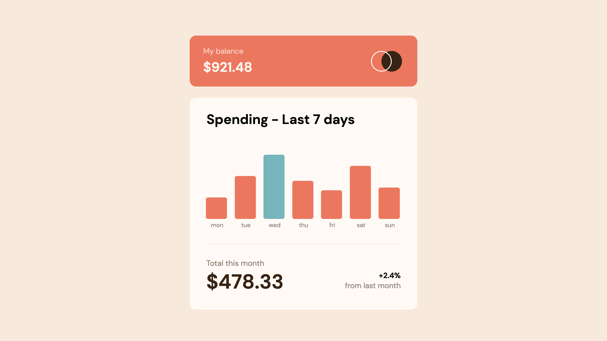

# Frontend Mentor - Expenses chart component solution

This is a solution to the [Expenses chart component challenge on Frontend Mentor](https://www.frontendmentor.io/challenges/expenses-chart-component-e7yJBUdjwt) using SASS/SCSS. Frontend Mentor challenges help you improve your coding skills by building realistic projects.

## Table of contents

- [Overview](#overview)
  - [The challenge](#the-challenge)
  - [Screenshot](#screenshot)
  - [Links](#links)
- [My process](#my-process)
  - [Built with](#built-with)
  - [What I learned](#what-i-learned)
  - [Continued development](#continued-development)
  - [Useful resources](#useful-resources)
- [Acknowledgments](#acknowledgments)

## Overview

### The challenge

Users should be able to:

- View the bar chart and hover over the individual bars to see the correct amounts for each day
- See the current day’s bar highlighted in a different colour to the other bars
- View the optimal layout for the content depending on their device’s screen size
- See hover states for all interactive elements on the page
- **Bonus**: Use the JSON data file provided to dynamically size the bars on the chart

### Screenshot



### Links

- Live Site URL: [Expenses chart component with Sass](https://tsune-web.github.io/FM-expenses-chart-component-with-Sass/)

## My process

### Built with

- Semantic HTML5 markup
- CSS custom properties
- Flexbox
- CSS Grid
- Mobile-first workflow
- SASS/SCSS
- Fetch API
- Live Server (VS Code extension for development)
  **_ My solution with vanilla JS requires this extension to display data from a local JSON file._**

### What I learned

1. SASS/SCSS basics

   - Variables
   - Nesting
   - Partials
   - Modules
   - at-rules (@use, @import, etc.)

2. JSON
   - Use fetch API to read a json file

### Continued development

- Working with JSON files
- Fetch API

- Adding dynamically changing bar colors based on the current day:

```js
function renderData() {
  fetch("data.json")
    .then((data) => data.json())
    .then((results) => {
      // Abbreviation


      // After creating all the bar elements
      function highlightDay() {
        const d = new Date();
        const day = d.getDay(); // returns 0(Sun) - 6(Sat)
        const today = day - 1;

        // fix mismatch of indexes of days
        // -> mon = today[1-1] or bars[0]
        // -> sun = today[0-1] or bars[6]
        let currBar;
        if (today === -1) {
          currBar = bars[6];
        } else {
          currBar = bars[today];
        }

        const bars = document.getElementsByClassName("bar");
        const currBar = bars[today];  // get the current element
        currBar.classList.add("today"); // add CSS for styling currBar
      }
    }
}
```

### Useful resources

- [JavaScript Tip: Loading a Local JSON File without Fetch](https://www.youtube.com/watch?v=Z92PqSyUBSI) - This YouTube video shows another approach to handling json files.
- [Sass: Documentation](https://sass-lang.com/documentation/) - This is a user-friendly resource to learn Sass/Scss.

## Acknowledgments

I express my gratitude to the programmer below who helped me with this challenge.

- CarolineLienard - [Expenses-Chart-Component](https://github.com/CarolineLienard/Expenses-Chart-Component) - This resource presents a skillful approach to this challenge only using vanilla JavaScript with fun animation.
